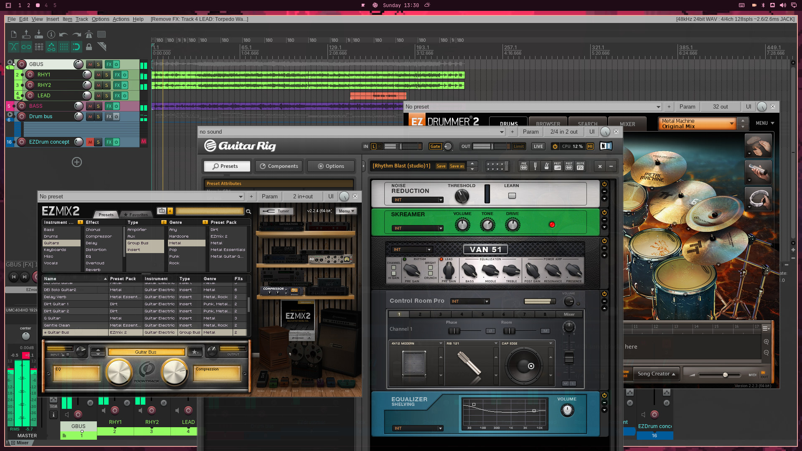

# OmaDAW

**Agentic DAW setup for the busy studio engineer.**

OmaDAW is how you and an agent set up an Omarchy machine for low-latency
recording: realtime PipeWire, a dedicated Wine prefix and yabridge for
Windows VSTs, and routing for Bitwig, Reaper, and Ardour. You say what you
need. The agent reads `AGENTS.md` and the skills in `skills/`, then runs the
idempotent scripts in this repo. You stay in the session for the parts only
you can do: logins, licenses, and listening.



## Work with the agent

```bash
./omadaw                                         # set up, then open the agent
./omadaw --profile studio --with-daw all --yes   # set up only (idempotent)
./omadaw doctor                                  # health check
./omadaw agent "set up for a USB interface at 128 frames with Reaper"
```

`./omadaw` with no arguments runs the installer, then opens the Omarchy
default agent in this repo so you can keep going. `./omadaw agent "<goal>"`
opens that agent directly. A goal is a sentence: install a plugin, fix a
silent DAW, bridge a new VST, or drop the quantum to 128. The agent reads
`AGENTS.md`, `MEMORY.md`, and the skills, so it does not rediscover this
machine from scratch.

## What the agent sets up

- **Realtime:** `realtime-privileges` + `rtkit`, user in the `realtime` group.
  A reboot or a full login is required before realtime is actually active.
- **PipeWire profiles:** `studio` 128 / `balanced` 256 / `safe` 512 frames
  at 48 kHz (`config/pipewire/...`). Switch live with
  `bin/omadaw-route profile <name>`.
- **Windows VSTs:** dedicated `~/.wine-omadaw` prefix (not `~/.wine`) and
  yabridge.
  ```bash
  bin/omadaw-vst install ~/Downloads/SomePluginSetup.exe
  bin/omadaw-vst sync          # discover new/updated plugins
  bin/omadaw-vst enable-watch  # background auto-sync on new files
  bin/omadaw-vst doctor
  ```
- **DAWs:** Reaper and Ardour from the repos, Bitwig from the AUR (the agent
  asks first). Backend and plugin-path notes live in `config/daw/`. Launch
  with `bin/omadaw-route launch <bitwig|reaper|ardour>`. Patch with
  `qpwgraph`.
- **Rollback:** `./omadaw --snapshot ...` snapshots the system (snapper) and
  user state (`~/.wine-omadaw`, PipeWire config, shims) first. Restore with
  `bin/omadaw-snapshot rollback-system` and `rollback-user latest`.

## When a library fills the disk

Move the library directory to a roomier disk and symlink it back, for example
`mv ~/.wine-omadaw/drive_c/.../Toontrack /games/soundlibs/ && ln -s
/games/soundlibs/Toontrack <original-path>`. Wine follows the link, so the
`C:\…` paths keep working. Stop the apps that have those files open first.

## Repo layout

`AGENTS.md` is the handbook the agent reads first: the map, Omarchy
conventions, and verification commands. `MEMORY.md` is this machine's
inventory and incidents. Skills live in `skills/omadaw-audio/` and
`skills/omadaw-vst/`.
